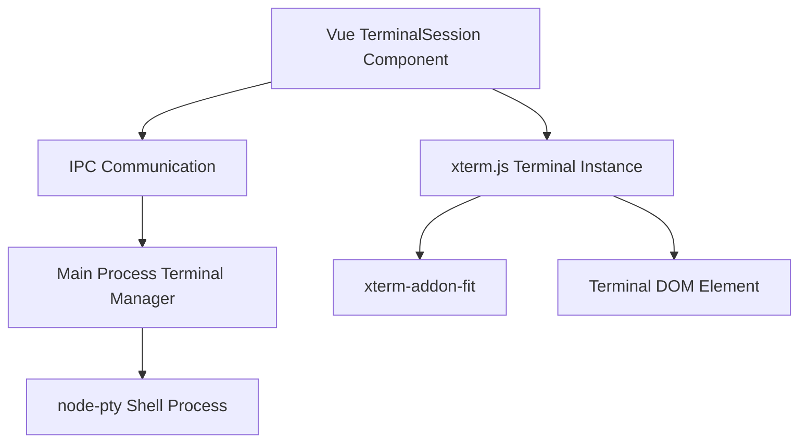

# Design Document

## Overview

This design outlines the upgrade of CLI Buddy's terminal implementation from a basic Vue component to a professional xterm.js-based terminal emulator. The implementation will follow VS Code's approach, using xterm.js in the renderer process with node-pty for shell process management in the main process.

## Architecture

### High-Level Architecture



### Process Communication

The terminal will use Electron's IPC (Inter-Process Communication) to bridge between the renderer process (Vue + xterm.js) and the main process (node-pty + shell):

1. **Renderer Process**: Handles UI, xterm.js terminal instance, user input
2. **Main Process**: Manages shell processes via node-pty, handles system-level operations
3. **IPC Bridge**: Secure communication channel for terminal data and commands

## Components and Interfaces

### 1. TerminalSession Vue Component (Renderer)

**Responsibilities:**
- Initialize and manage xterm.js terminal instance
- Handle terminal resizing with xterm-addon-fit
- Send user input to main process via IPC
- Receive and display output from main process

**Key Methods:**
```javascript
// Terminal lifecycle
initializeTerminal()
destroyTerminal()

// Communication
sendInput(data)
handleOutput(data)

// UI Management
handleResize()
focus()
```

### 2. Terminal Manager (Main Process)

**Responsibilities:**
- Create and manage node-pty shell processes
- Handle IPC communication with renderer
- Manage multiple terminal sessions
- Process cleanup on application exit

**Key Methods:**
```javascript
// Process management
createTerminal(options)
destroyTerminal(id)
writeToTerminal(id, data)

// IPC handlers
handleTerminalInput(event, data)
handleTerminalResize(event, cols, rows)
```

### 3. Preload Script Bridge

**Responsibilities:**
- Expose secure terminal APIs to renderer
- Bridge IPC communication
- Maintain security boundaries

**Exposed APIs:**
```javascript
window.electronAPI = {
  terminal: {
    create: (options) => ipcRenderer.invoke('terminal:create', options),
    write: (id, data) => ipcRenderer.invoke('terminal:write', id, data),
    resize: (id, cols, rows) => ipcRenderer.invoke('terminal:resize', id, cols, rows),
    destroy: (id) => ipcRenderer.invoke('terminal:destroy', id),
    onData: (callback) => ipcRenderer.on('terminal:data', callback),
    onExit: (callback) => ipcRenderer.on('terminal:exit', callback)
  }
}
```

## Data Models

### Terminal Configuration
```javascript
{
  id: string,           // Unique terminal identifier
  shell: string,        // Shell executable path
  cwd: string,          // Working directory
  env: object,          // Environment variables
  cols: number,         // Terminal columns
  rows: number          // Terminal rows
}
```

### Terminal Message
```javascript
{
  id: string,           // Terminal identifier
  type: 'data' | 'exit' | 'error',
  payload: any          // Message-specific data
}
```

## Error Handling

### Terminal Creation Errors
- **Shell not found**: Fallback to system default shell
- **Permission denied**: Display error message and disable terminal
- **Process spawn failure**: Retry with alternative shell options

### Runtime Errors
- **Process crash**: Automatically restart terminal with user notification
- **IPC communication failure**: Reconnect and restore terminal state
- **Memory issues**: Implement output buffering and cleanup
- **Detect crash loops**: Display error message and disable terminal if a crash loop is detected 

### Error Recovery Strategies
1. **Graceful degradation**: Failures are aggregated. Display error message and disable terminal if excessive number of failures in a single session
2. **Process restart**: Automatic recovery for crashed shell processes
3. **State preservation**: Maintain terminal history during recoverable errors

## Testing Strategy

### Unit Tests

**TerminalSession Component Tests:**
- Terminal initialization and cleanup
- Input handling and IPC communication
- Resize functionality
- Error state handling

**Terminal Manager Tests:**
- Process creation and management
- IPC handler functionality
- Multiple terminal session handling
- Cleanup on application exit

### Integration Tests

**End-to-End Terminal Flow:**
- Complete command execution cycle
- Real shell process interaction
- Terminal resizing behavior
- Process termination handling

### Test Environment Setup
- Mock node-pty for unit tests
- Use test shells for integration tests
- Automated testing in CI/CD pipeline
- Cross-platform testing (macOS, Windows, Linux)

## Implementation Considerations

### Dependencies
- **xterm**: Core terminal emulator (v5.3.0)
- **xterm-addon-fit**: Terminal resizing addon (v0.8.0)
- **node-pty**: Shell process management (to be added)

### Performance Optimizations
- **Output buffering**: Batch terminal output for better performance
- **Virtual scrolling**: Handle large output efficiently
- **Memory management**: Limit terminal history and implement cleanup

### Security Considerations
- **Context isolation**: Maintain Electron security boundaries
- **Input sanitization**: Validate all terminal input
- **Process isolation**: Properly sandbox shell processes
- **IPC validation**: Validate all inter-process messages

### Cross-Platform Compatibility
- **Shell detection**: Automatically detect appropriate shell per OS
- **Path handling**: Use platform-appropriate path separators
- **Environment variables**: Handle OS-specific environment setup
- **Process management**: Account for different process mode